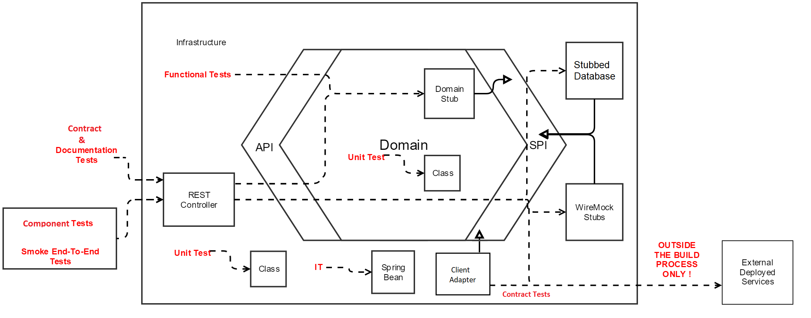

# TalkAdvisor
[](https://gitlab.com/crafts-records/talkadvisor/talkadvisor-back/commits/master)

TalkAdvisor is a [hexagonal architecture](https://beyondxscratch.com/2017/08/19/decoupling-your-technical-code-from-your-business-logic-with-the-hexagonal-architecture-hexarch) demo application developed with Kotlin and SpringBoot.
This application recommends IT Talks recorded on YouTube given some criteria

## Build

To build TalkAdvisor, run the following command:
```
mvn clean install
```
By default the build will run the integration acceptances tests against an isolated TalkAdvisor instance using wiremock to 
stub external services.

### Launching the End to End tests
To launch those tests, you need first a run a "deployed" instance of TalkAdvisor. Please refer to [Running the application.](#running-the-application)

Then you can launch the end-to-end tests:
```
cd talkadvisor-infra/talkadvisor-infra-acceptance-tests
mvn test -De2e
```

## Running the application
### Production mode
In order to run TalkAdvisor in "production" mode, you need to generate a [Google Api Token](https://developers.google.com/youtube/registering_an_application).
Once the token generated, you can define an environment variable named ``GOOGLE_API_KEY`` which will be automatically taken by TalkAdvisor.

Then you'll be able to run TalkAdvisor as follow:
```
cd talkadvisor-infra/talkadvisor-infra-application
mvn spring-boot:run
``` 
or
```
cd talkadvisor-infra/talkadvisor-infra-application
java -jar target/talkadvisor-infra-application-0.0.1-SNAPSHOT.jar
``` 

You can also use: ``--GOOGLE_API_KEY=`` in the command line if you don't want to store it in your env.

### Development mode
If you don't want to generate a Google Api Token, you can launch TalkAdvisor with an embedded wiremock which will [stub YouTube](https://gitlab.com/crafts-records/talkadvisor/talkadvisor-back/blob/master/talkadvisor-infra/talkadvisor-infra-external-stubs/src/main/kotlin/org/craftsrecords/talkadvisor/infra/externalstubs/ExternalStubsApplicationInitializer.kt``````) by adding ``--spring.profiles.active=YouTubeStub`` to the command line.
You can also use the [search talk domain stub](https://gitlab.com/crafts-records/talkadvisor/talkadvisor-back/blob/master/talkadvisor-domain/src/main/kotlin/org/craftsrecords/talkadvisor/recommendation/spi/stubs/HardCodedTalksSearcher.kt) with ``--spring.profiles.active=searchTalksStub``, 
it will stub TalkAdvisor at the SPI level so http calls will be made and no wiremock instance will be launched.

 
## Testing Strategy


### Unit Test and Test Composition:

For example in the resources, when testing the mapping of a Profile Domain to a Profile Resource,
we don't add a unit test inside resources.PreferencesTest to verify the mapping of a Preferences Resource 
since the Profile, which contains it, will test it by composition 
#### Custom Assertions
[TALK] talk about custom assert and factories

Custom asserts in the adapters: Mapping a domain object to an adapter one can be done in several places
Storing the mapping validation inside a custom assert will ensure no mapping tests will miss a new acceptance criteria.
TODO: GIVE AN EXAMPLE IN THE CODE

##Improvement
use Topics, Talks etc. classes instead of Iterable<Set>, Iterable<Talk>...