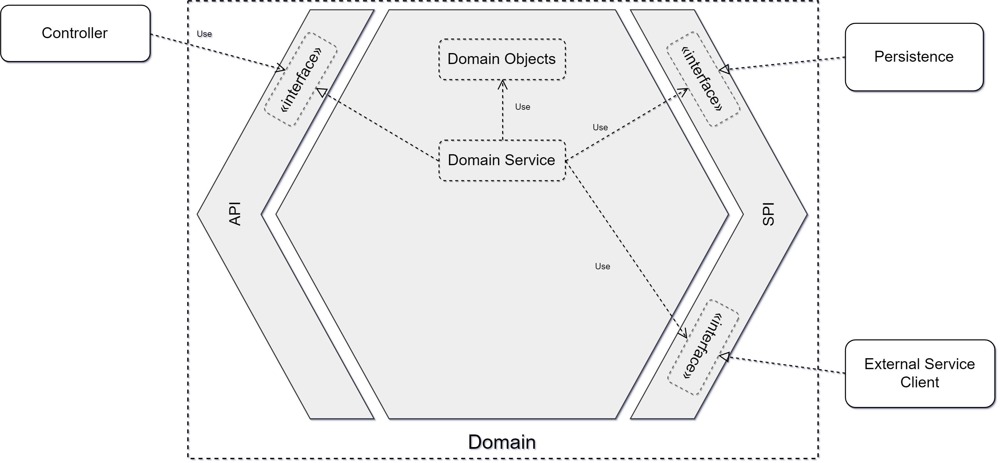

# TalkAdvisor
[](https://gitlab.com/crafts-records/talkadvisor/talkadvisor-back/commits/master)

TalkAdvisor is a [hexagonal architecture](https://beyondxscratch.com/2017/08/19/decoupling-your-technical-code-from-your-business-logic-with-the-hexagonal-architecture-hexarch) demo application developed with Kotlin and SpringBoot.
This application recommends IT Talks recorded on YouTube given some criteria



## Build  

To build TalkAdvisor, run the following command:
```
mvn clean install
```
By default the build will run the integration acceptances tests against an isolated TalkAdvisor instance using wiremock to 
stub external services.

### Launching the End to End tests
To launch those tests, you need first a run a "deployed" instance of TalkAdvisor. Please refer to [Running the application.](#running-the-application)

Then you can launch the end-to-end tests:
```
cd talkadvisor-infra/talkadvisor-infra-acceptance-tests
mvn test -De2e
```

## Running the application
### Production mode
In order to run TalkAdvisor in "production" mode, you need to generate a [Google Api Token](https://developers.google.com/youtube/registering_an_application).
Once the token generated, you can define an environment variable named ``GOOGLE_API_KEY`` which will be automatically taken by TalkAdvisor.

Then you'll be able to run TalkAdvisor as follow:
```
cd talkadvisor-infra/talkadvisor-infra-application
mvn spring-boot:run
``` 
or
```
cd talkadvisor-infra/talkadvisor-infra-application
java -jar target/talkadvisor-infra-application-0.0.1-SNAPSHOT.jar
``` 

You can also use: ``--GOOGLE_API_KEY=`` in the command line if you don't want to store it in your env.

### Development mode
If you don't want to generate a Google Api Token, you can launch TalkAdvisor with an embedded wiremock which will [stub YouTube](https://gitlab.com/crafts-records/talkadvisor/talkadvisor-back/blob/master/talkadvisor-infra/talkadvisor-infra-external-stubs/src/main/kotlin/org/craftsrecords/talkadvisor/infra/externalstubs/ExternalStubsApplicationInitializer.kt``````) by adding ``--spring.profiles.active=YouTubeStub`` to the command line.
You can also use the [search talk domain stub](https://gitlab.com/crafts-records/talkadvisor/talkadvisor-back/blob/master/talkadvisor-domain/src/main/kotlin/org/craftsrecords/talkadvisor/recommendation/spi/stubs/HardCodedTalksSearcher.kt) with ``--spring.profiles.active=searchTalksStub``, it will stub TalkAdvisor at the SPI level so http calls will be made and no wiremock instance will be launched.

## Living Documentation

Once TalkAdvisor is running, you can reach the documentation of the REST API with this URL

```
http://localhost:7777/docs/rest-api.html
```

## Technical Overview

TalkAdvisor is composed of 4 different modules:

### talkadvisor-domain the inside of the hexagon

This single module holds all the business value of the application where you find its aggregate [Recommendation](https://gitlab.com/crafts-records/talkadvisor/talkadvisor-back/blob/master/talkadvisor-domain/src/main/kotlin/org/craftsrecords/talkadvisor/recommendation/Recommendation.kt).
[Maven has been configured](https://gitlab.com/crafts-records/talkadvisor/talkadvisor-back/blob/master/talkadvisor-domain/pom.xml) such a way to prevent any external artifacts from being imported in the domain:

```xml
            <plugin>
                <artifactId>maven-enforcer-plugin</artifactId>
                <executions>
                    <execution>
                        <goals>
                            <goal>enforce</goal>
                        </goals>
                        <configuration>
                            <rules>
                                <bannedDependencies>
                                    <excludes>
                                        <exclude>*</exclude> <!-- forbids non domain dependencies -->
                                    </excludes>
                                    <includes>
                                        <!-- but allow kotlin dependencies-->
                                        <include>org.jetbrains.kotlin:*</include>
                                        <include>org.jetbrains:annotations</include>
                                        <!-- and commons-lang3 because we don't want to make the wheel again -->
                                        <include>org.apache.commons:commons-lang3</include>
                                        <!-- and test dependencies-->
                                        <include>*:*:*:*:test</include>
                                    </includes>
                                </bannedDependencies>
                            </rules>
                        </configuration>
                    </execution>
                </executions>
            </plugin>
```

if any dependency is added to the pom, the build will fail if it is not allowed in this list.

### talkadvisor-infra the outside of the hexagon

All the adapters are gathered in the talkadvisor-infra modules. talkadvisor-infra is a parent pom which centralizes the common configurations of all the adapters (Spring Boot BOM,...).
The infrastructure is divided in 3 modules.

#### talkadvisor-infra-application

The whole application resides in this module. You can find here the [controllers](https://gitlab.com/crafts-records/talkadvisor/talkadvisor-back/tree/master/talkadvisor-infra/talkadvisor-infra-application/src/main/kotlin/org/craftsrecords/talkadvisor/infra/controller), 
the [YouTube Client](https://gitlab.com/crafts-records/talkadvisor/talkadvisor-back/tree/master/talkadvisor-infra/talkadvisor-infra-application/src/main/kotlin/org/craftsrecords/talkadvisor/infra/youtube) (SPI Adapter),
the [REST resources](https://gitlab.com/crafts-records/talkadvisor/talkadvisor-back/tree/master/talkadvisor-infra/talkadvisor-infra-application/src/main/kotlin/org/craftsrecords/talkadvisor/infra/resources) (API Adapter), 
and the [Spring Boot Application](https://gitlab.com/crafts-records/talkadvisor/talkadvisor-back/blob/master/talkadvisor-infra/talkadvisor-infra-application/src/main/kotlin/org/craftsrecords/talkadvisor/infra/TalkAdvisorApplication.kt).

#### talkadvisor-infra-external-stubs

Holds the [stubs of the external services](https://gitlab.com/crafts-records/talkadvisor/talkadvisor-back/blob/master/talkadvisor-infra/talkadvisor-infra-external-stubs/src/main/kotlin/org/craftsrecords/talkadvisor/infra/externalstubs/ExternalStubsApplicationInitializer.kt), basically this is a [wiremock-based](http://wiremock.org/docs/) infrastructure where have been stored some responses payloads of the request we make to YouTube.
Those stubs are launched during the [integration acceptance tests](#talkadvisor-infra-acceptance-tests) in order to totally isolate the CICD build of TalkAdvisor.
They can also be used to run the application, see [Running the application](#running-the-application).

#### talkadvisor-infra-acceptance-tests

Integration acceptance and end to end tests of the application. They are launched at each builds against a local instance of TalkAdvisor with the external stubs.
The end to end tests can also be launched against a deployed instance plugged with real calls to YouTube, see [launching the end to end tests](#launching-the-end-to-end-tests).

## Testing Strategy

If you wan to learn more on the testing strategy applied in TalkAdvisor, [here](TestingStrategy.md) is the dedicated documentation.

## Contributors

Julien Topçu - @JulienTopcu

Jordan Nourry - @JkNourry

Juliette de Rancourt - @ju_derancourt 

From craftsrecords.org

## Special Credit
TalkAdvisor Project Icon made by Freepik from www.flaticon.com 