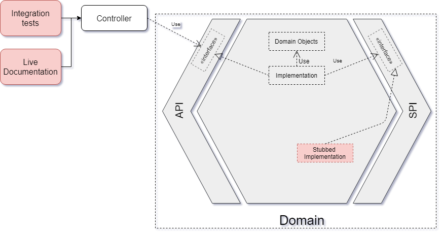

# Testing Strategy
>
> Work In Progress !!! Infrastructure Level tests are not documented yet.
>

TalkAdvisor is following the [microservice testing philosophy](https://martinfowler.com/articles/microservice-testing/#conclusion-summary).
We will try here to explain how to get a cleaner test strategy in a microservice implemented according to the Hexagonal Architecture.


## Functional Tests

### The anti-pattern

Working with Domain-Driven Design and the Hexagonal Architecture, usually means applying the Behavior-Driven Development methodology.
Many people have understood it and this technique is now widely spread. Unfortunately, we often see that the functional tests used to describe the behavior of modern application, are implemented as a http client hitting the endpoints of the controllers.
The main drawback of this (anti-)pattern is the mix of the testing concerns. With this kind of test, we have something that has the responsibility to verify:
 * the business logic of the application *(functional tests)*
 * the contract of the external API *(contract tests)*
 * the workflow offered to the consumer - or something which looks like to it *(end to end tests)*
 * sometimes the mapping between the domain objects and the adapters *(unit tests / integration tests)*
 * the integration of the different sub-components of the application such as the Controllers, the DomainServices, the Repositories... *(integration tests / component tests)*
 * and most of the time without knowing it: the living documentation *(contract testing)*
 
A simple serialization problem will fail this kind of test, and as a developer we will have to figure out if a regression has been made in the business logic or if something goes wrong with the configuration of a framework.
Which becomes a real hell when upgrading a structural framework like Spring Boot after playing search-and-destroy with the compilation errors...

The sustainability is not the only victim of this technique. Which framework to use when having a test which has that many responsibilities? [Cucumber](https://docs.cucumber.io/) might be one of the best choice to express the rules and the acceptance criteria of the business.
But testing the contract of a web API with it, can be really cu-cumbersome and the developer efficiency might be left behind.

### The Best practices

Back to the basics, since the aim of a functional test is "testing the business logic", putting it inside the domain of our application looks like a good idea. As a result instead of calling the endpoints, those tests are plugged in top of the API of the domain (not the Web API one).



In TalkAdvisor, [Cucumber](https://docs.cucumber.io/) is used to define the features and the scenarios of our business logic. As you can see the feature files are located in [the tests packages of the domain](https://gitlab.com/crafts-records/talkadvisor/talkadvisor-back/tree/master/talkadvisor-domain/src/test/resources/features) beside the [step definitions](https://gitlab.com/crafts-records/talkadvisor/talkadvisor-back/tree/master/talkadvisor-domain/src/test/kotlin/org/craftsrecords/talkadvisor/recommendation/stepdefs).
Using the [Gherkin language](https://docs.cucumber.io/gherkin/reference/), we express the scenarios of a feature [creating-a-profile.feature](https://gitlab.com/crafts-records/talkadvisor/talkadvisor-back/blob/master/talkadvisor-domain/src/test/resources/features/creating-a-profile.feature):
```gherkin
Feature: As a frequent user,
  In order not repeat my preferences at each request,
  I want to create my profile with my preferences

  Scenario: The user is creating his profile with his preferences

    Given a user
    And he wants to learn
      | DDD | hexagonal architecture |
    And he only wants to see
      | QUICKIE | CONFERENCE |
    When he creates his profile
    Then his preferences are stored within
```

Let's remind some best practices here:
 * the scenario must be functional and [not technical](https://docs.cucumber.io/bdd/better-gherkin/)
 * the persona must be defined ``As a frequent user`` because a feature performed by different persona is really likely to have distinct acceptance criteria. Think about what differences you can have when an admin or an user are using the same feature
 * Only **ONE** When, you should test one thing at a time, what's about the acceptance criteria with several whens ?
 * Don't use conjunctions in your Givens and Thens, it makes them really hard to reuse, prefer to split your step into several ones  

The step definitions are the fixtures of your test, they implement all the Gherkin's directives of your features [ProfileStepdefs.kt](https://gitlab.com/crafts-records/talkadvisor/talkadvisor-back/blob/master/talkadvisor-domain/src/test/kotlin/org/craftsrecords/talkadvisor/recommendation/stepdefs/ProfileStepdefs.kt):
```kotlin
import org.craftsrecords.talkadvisor.recommendation.api.CreateProfile
import org.craftsrecords.talkadvisor.recommendation.spi.Profiles

class ProfileStepdefs(private val testContext: TestContext,
                      private val createProfile: CreateProfile,
                      private val profiles: Profiles) {

    @Given("^he already has a profile$")
    fun `he already has a profile`() {
        val profile = Profile(testContext.userId, createPreferences())
        profiles.save(profile)
    }

    @When("^he creates his profile$")
    fun `he creates his profile`() {
        val preferences = preferencesFromContext()

        val profile = createProfile.forUserWithPreferences(testContext.userId, preferences)

        testContext.requestedPreferences = preferences
        testContext.createdProfile = profile
    }


    @Then("^his preferences are stored within$")
    fun `his preferences are stored within`() {
        val profile = testContext.createdProfile
        val frequentUser = testContext.userId
        val hisPreferences = testContext.requestedPreferences

        profile.that `corresponds to user` frequentUser
        profile.that `has preferences` hisPreferences
    }
}
```
> You may have noticed some strange assertions here: ```profile.that `corresponds to user` frequentUser```, which framework is that? Let's discover it in that [section](#custom-assertions).

Like said above, instead of hitting the web endpoints of the application, we are using directly here the domain API, through [CreateProfile](https://gitlab.com/crafts-records/talkadvisor/talkadvisor-back/blob/master/talkadvisor-domain/src/main/kotlin/org/craftsrecords/talkadvisor/recommendation/api/CreateProfile.kt) - a domain service.
So basically all the Whens of our step definitions will call the methods of the domain services exposed through the API = **the features**. In the Givens and the Thens, we respectively creates and asserts on the domain objects. And if needed we can bootstrap or assert some data through the SPI. 
You can see this in the example above, in a scenario [not shown here](https://gitlab.com/crafts-records/talkadvisor/talkadvisor-back/blob/d58d0dee5b92eac15765d6f0f1bd467040dae915/talkadvisor-domain/src/test/resources/features/profiles.feature#L17), the fact that the user already has a profile is a prerequisite. 
So a profile is bootstrapped for this user directly stored in the "database" using the [Profile repository](https://gitlab.com/crafts-records/talkadvisor/talkadvisor-back/blob/master/talkadvisor-domain/src/main/kotlin/org/craftsrecords/talkadvisor/recommendation/spi/Profiles.kt) in the SPI.
You can also use the same technique when using a side effect feature to perform some assertions in a Then.

Most of the time, users split their step definitions in the same way as their scenarios. As you can read from the [cucumber documentation itself](https://docs.cucumber.io/guides/anti-patterns/), it couples everything together and the steps you made cannot be reused for another scenario.
The step definitions should be organised in the same way than your domain concepts and, moreover, named after them. This way your step definitions code will be factorized, easier to find and navigate through, you'll get easier steps to manage and reuse. In other words, **the step definitions should be designed with the same processes we use to create our business domain!**

You may wondering how we can share data between several step definitions which is mandatory if we need to reuse them. Cucumber is offering [an integration with the Pico container](https://docs.cucumber.io/cucumber/state/#dependency-injection), a lightweight dependency injection framework.
Once the dependency is added to your pom, you simply have to define a Bean Factory where you will register the beans you need [CustomPicoFactory](https://gitlab.com/crafts-records/talkadvisor/talkadvisor-back/blob/master/talkadvisor-domain/src/test/kotlin/org/craftsrecords/talkadvisor/CustomPicoFactory.kt):

```kotlin
class CustomPicoFactory : PicoFactory() {
    init {
        addClass(TestContext::class.java)
        addClass(TalksAdvisor::class.java)
        addClass(HardCodedTalksSearcher::class.java)
        addClass(InMemoryRecommendations::class.java)
        addClass(ProfileCreator::class.java)
        addClass(InMemoryProfiles::class.java)
    }
}
```

Then define a [cucumber.properties](https://gitlab.com/crafts-records/talkadvisor/talkadvisor-back/blob/master/talkadvisor-domain/src/test/resources/cucumber.properties) in your test resources, to register this factory in the Cucumber context.

```properties
cucumber.api.java.ObjectFactory=org.craftsrecords.talkadvisor.CustomPicoFactory
```

With that no need to have a test dependency on the whole Spring Framework! Pico is really easy to set-up as easy to use.
Now you can inject your Domain Services and Stubs inside your step definitions and as well share [a context](https://gitlab.com/crafts-records/talkadvisor/talkadvisor-back/blob/master/talkadvisor-domain/src/test/kotlin/org/craftsrecords/talkadvisor/recommendation/stepdefs/TestContext.kt) between them.

> Last Tip: Instead of having one single launcher for all the function tests, you can have one launcher per scenario. This is pretty convenient when you only want to run the scenarios of a single feature without playing with tags and configuration. Take a look at this [example](https://gitlab.com/crafts-records/talkadvisor/talkadvisor-back/blob/master/talkadvisor-domain/src/test/kotlin/org/craftsrecords/talkadvisor/recommendation/RecommendationFunctionalTests.kt). 

### Domain Stubs

While implementing a feature, we often need to call some external dependencies which offers a service to our domain, such as [YouTubeSearchTalks](https://gitlab.com/crafts-records/talkadvisor/talkadvisor-back/blob/master/talkadvisor-infra/talkadvisor-infra-application/src/main/kotlin/org/craftsrecords/talkadvisor/infra/youtube/YouTubeSearchTalks.kt) our YouTube client.
But since the domain cannot depends on external stuff, how can we test it ? The response is pretty simple, we creates a lightweight component which implements the SPI **inside the domain** [HardCodedTalksSearcher](https://gitlab.com/crafts-records/talkadvisor/talkadvisor-back/blob/master/talkadvisor-domain/src/main/kotlin/org/craftsrecords/talkadvisor/recommendation/spi/stubs/HardCodedTalksSearcher.kt). 
This will ensure the inside of the hexagon - the domain of our application - will be self-tested.
Why not only a Mock inside the tests ? The domain stub is more that just a testing tool, it helps you to focus on the important thing of your development process, more information about that [here](https://beyondxscratch.com/2017/08/19/decoupling-your-technical-code-from-your-business-logic-with-the-hexagonal-architecture-hexarch/).

Actually in TalkAvisor, only the SPI part related to the provisioning of the Talks has been implemented through a YouTube client. The repositories which are used to store our profiles and recommendations are implemented using HashMaps e.g. [InMemoryProfiles](https://gitlab.com/crafts-records/talkadvisor/talkadvisor-back/blob/master/talkadvisor-domain/src/main/kotlin/org/craftsrecords/talkadvisor/recommendation/spi/stubs/InMemoryProfiles.kt).
This way we can focus on the main purpose of the application - recommending talks - and delay some technical concern like "what will be the best database system for my software ?".


### Low-Level Assertions Caveat

Assertions frameworks like [AssertJ](http://joel-costigliola.github.io/assertj/) are widely spread now. They are offering a fluent way of writing our acceptance criteria.
TalkAdvisor has to make sure that talks which belong to a recommendation are related to the topics of the user preferences. In the MVP of our application, we will consider a [talk](https://gitlab.com/crafts-records/talkadvisor/talkadvisor-back/blob/master/talkadvisor-domain/src/main/kotlin/org/craftsrecords/talkadvisor/recommendation/talk/Talk.kt) is related to a topic
if its title contains the given topic. In the different tests where we want to check this post-condition, we will end-up with something like this:
```kotlin
//Talk level tests assertion
assertThat(talk.title).contains("topic")

//Recommendation level tests assertion
assertThat(recommendation.talks.map { it.title }).anyMatch{ it.contains("topic") } 
```

First we lost the intend of the test, it will require some thought for someone who doesn't know the project why - the hell - we are checking a talk is containing the requested topic.
But that's not the only caveat. If now we have this new requirement "We consider a talk is related to a topic, if its title AND its description contains the topic", we will have to update all the tests
which are responsible to verify (may be at different levels) this new requirement. We can add the new assertion on the first test but leave the second one as it and all the tests will pass.
In that case we may have a functional hole on the recommendation side, but everyone is reviewing all the tests of the application each time a new business rule is added right?..

To fix the problem, with the help of some Domain-Driven Design & Clean Code concepts, we will **encapsulate** the acceptance criteria - the second assertion is btw violating the encapsulation of the recommendation.
This way those "encapsulations" will be reused so it will ensure that every tests which requires the same acceptance criteria will be checked the same way.
But where ? In the production code? No, we will use custom assertions.

### Custom Assertions

AssertJ is extendable, you can write [custom assertions](http://joel-costigliola.github.io/assertj/assertj-core-custom-assertions.html) dedicated to your own domain in a fluent way like this:

```kotlin
assertThat(talks).areRelatedTo(topic)
``` 

To do such thing you need to create some Assertions class like [TalkAsserts](https://gitlab.com/crafts-records/talkadvisor/talkadvisor-back/blob/master/talkadvisor-domain/src/test/kotlin/org/craftsrecords/talkadvisor/recommendation/assertions/TalkAsserts.kt):

```kotlin
class TalkAssert(actual: Talk) : AbstractAssert<TalkAssert, Talk>(
        actual,
        TalkAssert::class.java
) {

    infix fun `is related to topic`(topicName: String) {
        matches({ it.title.contains(topicName) }, "is related to topic $topicName")
    }

    infix fun `is in the format`(talkFormat: TalkFormat) {
        matches({ it.format == talkFormat }, "correspond explicitly to the format $talkFormat")
    }
}

```

If you look also to [RecommendationAssert](https://gitlab.com/crafts-records/talkadvisor/talkadvisor-back/blob/master/talkadvisor-domain/src/test/kotlin/org/craftsrecords/talkadvisor/recommendation/assertions/RecommendationAssert.kt)

```kotlin
class RecommendationAssert(actual: Recommendation) : AbstractAssert<RecommendationAssert, Recommendation>(
        actual,
        RecommendationAssert::class.java
) {

    infix fun `has talks related to`(topicName: String) {
        matches({
            it.criteria.topics.any { topic -> topic.name == topicName }
        }, "recommendations criteria has the topic $topicName")

        actual.talks.those `are related to topic` topicName
    }
}

```

You can also see that there is a real encapsulation of the acceptance criteria, because a recommendation related to a specific topic means at least one of its talk is related to that topic and also the stored user criteria are also related to it.
Otherwise there will be an inconsistency. So next time we have to write a test where we want to check this acceptance criteria, we won't have to recode all of them - we will keep in our tests a **single level of abstraction on the assertions** as well.

And TJWHEN!!! *(Thanks JetBrains We Have Extensions Now)* We can write it in a sexier way than the assertThat. Once your assertions classes are created, you can extend your class in your test to attach the assertions to it.

So you'll be able to write stuffs like:

```kotlin
 @Then("^the recommended talks correspond to his preferences$")
    fun `the recommended talks correspond to his preferences`() {
        val recommendation = testContext.recommendation
        val profile = testContext.createdProfile
        val preferences = profile.preferences

        recommendation.that `corresponds to the criteria` preferences
        recommendation.that `has talks related to` preferences.topics
        recommendation.that `has only talks in the formats` preferences.talksFormats
    }
``` 

To do such things, take a look at [DomainAssertions](https://gitlab.com/crafts-records/talkadvisor/talkadvisor-back/blob/master/talkadvisor-domain/src/test/kotlin/org/craftsrecords/talkadvisor/recommendation/assertions/DomainAssertions.kt)
```kotlin
val Recommendation.that: RecommendationAssert
    get() = RecommendationAssert(this)

val Talk.that: TalkAssert
    get() = TalkAssert(this)

val Iterable<Talk>.those: TalksAssert
    get() = TalksAssert(this)

val Profile.that: ProfileAssert
    get() = ProfileAssert(this)
```

We also have custom assertions inside the infrastructure [ResourcesAssertions](https://gitlab.com/crafts-records/talkadvisor/talkadvisor-back/blob/master/talkadvisor-infra/talkadvisor-infra-application/src/test/kotlin/org/craftsrecords/talkadvisor/infra/resources/assertions/ResourcesAssertions.kt). 
They are mainly used to make sure the "acceptance criteria" of a mapping of a domain object to an adapter one (and also the opposite) will be shared by all the mappers.

> AssertJ also provide some [assertions generators](http://joel-costigliola.github.io/assertj/assertj-assertions-generator.html), in order to get automatically domain-field based assertions like ``assertThat(talk).hasTitle(title)``.
> This feature is unfortunately not used on the current project.
 
## Unit Tests

### Domain Object Factories

In Domain-Driven Design, the domain **is not composed of POJOs!** It means the domain objects should not exposes their states but their behaviors through the encapsulation. So mocking a domain object is prohibited.
Why ? Let's imagine you are mocking a Talk object so it will say that it has a duration of 1 hour and its [format](https://gitlab.com/crafts-records/talkadvisor/talkadvisor-back/blob/master/talkadvisor-domain/src/main/kotlin/org/craftsrecords/talkadvisor/recommendation/talk/TalkFormat.kt) is an IGNITE.
Which doesn't make sense right ? And what's about [the test which is built on top of it](https://gitlab.com/crafts-records/talkadvisor/talkadvisor-back/blob/39338377d4ac8b76b128e7767d6de9f602e37b7c/talkadvisor-infra/talkadvisor-infra-application/src/test/kotlin/org/craftsrecords/talkadvisor/recommendation/MockCaveatTest.kt)? 

A domain object, thanks to the validation logic of its constructor, will always ensures that it is coherent, no need to check it after the creation. It saves us from a lot of bugs!
But the counterpart is it makes the tests harder to write. Because each time we want to do a test where a recommendation is needed, it has to be built correctly and you have to think about all the business rules...
The best way to fix that is the usage of domain object factories. In those factory, we put once for all the creation logic of a domain object which is reused in every tests which needs an instance.

In TalkAdvisor, we have for example [TalkFactory](https://gitlab.com/crafts-records/talkadvisor/talkadvisor-back/blob/master/talkadvisor-domain/src/test/kotlin/org/craftsrecords/talkadvisor/recommendation/talk/TalkFactory.kt)

```kotlin
fun createTalk(criteria: Criteria): Talk {
    return prepareBuilder()
            .apply { duration = durationFrom(criteria) }
            .build()
}

private fun durationFrom(criteria: Criteria) = criteria.talksFormats.random().randomDuration()

fun createTalk(): Talk {
    return prepareBuilder().apply { duration = ofMinutes(Random.nextLong(2, 120)) }.build()
}
```

As you can see here, we have a factory of Talks which is taking as parameters some criteria. The reason is when you want to create a Recommendation, you have to make sure the stored criteria and the talks are aligned.
So in the [tests](https://gitlab.com/crafts-records/talkadvisor/talkadvisor-back/blob/master/talkadvisor-domain/src/test/kotlin/org/craftsrecords/talkadvisor/recommendation/RecommendationTest.kt) we are reusing them to create a valid Recommendation.

```kotlin
   @Test
    fun `should create a recommendation`() {
        val (criteria, talks) = bootstrap()

        val recommendation = Recommendation(criteria = criteria, talks = talks)

        assertThat(recommendation.id).isNotNull()
        assertThat(recommendation.talks).isEqualTo(talks)
        assertThat(recommendation.criteria).isEqualTo(criteria)
    }
    
    private fun bootstrap(): Pair<Criteria, Set<Talk>> {
        val criteria = createCriteria()
        val talks = createTalks(criteria)
        return Pair(criteria, talks)
    }

```

**IMPORTANT NOTICE:** You should never use this kind of factory when you care about the values inside - because if someone is changing the creation logic, your test will fail. It should be used only like black boxes in order to quickly bootstrap data for the tests.
When you are expecting some specific values for domain objects, **you should create it explicitly in your test**, like done in [RecommendationControllerTest](https://gitlab.com/crafts-records/talkadvisor/talkadvisor-back/blob/master/talkadvisor-infra/talkadvisor-infra-application/src/test/kotlin/org/craftsrecords/talkadvisor/infra/controller/RecommendationControllerTest.kt#L112).
Since the controller test if actually verifying the values inside the returned JSON are the expected ones - more precisely the preferences of stored the profile, we explicitly create the profile. 

> You can also share pre-initialized builders if needed. 

### Test Composition

Opening the debate...

Let's now take a look at the [Profile](https://gitlab.com/crafts-records/talkadvisor/talkadvisor-back/blob/master/talkadvisor-infra/talkadvisor-infra-application/src/main/kotlin/org/craftsrecords/talkadvisor/infra/resources/Profile.kt) resource inside the REST adapter.

```kotlin 
data class Profile(private val id: String, val preferences: Preferences) : Identifiable<String> {
    override fun getId() = id
}

fun DomainProfile.toResource(): Profile = Profile(this.id, this.preferences.toResource())
```

Profile is a top-level resource which contains a sub-resource named preferences (same composition than the domain). In order to convert a Profile of the domain to a resource, an extension method ``toResource`` has been defined.
You can also see the resource transformation is cascaded to the inner preferences. When [testing the Profile resource transformation](https://gitlab.com/crafts-records/talkadvisor/talkadvisor-back/blob/master/talkadvisor-infra/talkadvisor-infra-application/src/test/kotlin/org/craftsrecords/talkadvisor/infra/resources/ProfileTest.kt), we will also test by transitivity the transformation of the preferences into a resource.
So there is no need to repeat this test at [Preferences level](https://gitlab.com/crafts-records/talkadvisor/talkadvisor-back/blob/master/talkadvisor-infra/talkadvisor-infra-application/src/test/kotlin/org/craftsrecords/talkadvisor/infra/resources/PreferencesTest.kt). 

That's totally fine since the Preferences resource is never used outside of the transformation of a Profile or a Recommendation (the only objects using it). When adopting a black-box test approach, e don't really care about the implementation, but only the exposed behavior.
Fortunately with the encapsulation principle, we expose the behavior only through a limited number of classes: domain aggregates for entities and value objects and domain services implementing the API.
It means you only have to write a test where the behavior is exposed. You'll limit this way the number of (useless) tests you'll have to maintain.

On the other hand, edge-cases should be tested directly on the object which has the effective responsibility of dealing with those cases. For example [PreferencesTest](https://gitlab.com/crafts-records/talkadvisor/talkadvisor-back/blob/master/talkadvisor-infra/talkadvisor-infra-application/src/test/kotlin/org/craftsrecords/talkadvisor/infra/resources/PreferencesTest.kt) is testing for the mapping of an unknown TalkFormat (enum):

```kotlin 
    @Test
    fun `should throw IllegalArgumentException when trying to map an unknown TalkFormat`() {
        val topics = listOf(Topic("topic"))
        val talksFormats = listOf("UNKNOWN")
        val preferences = Preferences(topics, talksFormats)

        assertThatThrownBy { preferences.toDomainObject() }
                .isInstanceOf(IllegalArgumentException::class.java)
                .hasMessage("No enum constant ${TalkFormat::class.java.name}.UNKNOWN")
    }
```

You'll not find this test in the upper-levels of the hierarchy of the Preferences resource, like [Profile](https://gitlab.com/crafts-records/talkadvisor/talkadvisor-back/blob/master/talkadvisor-infra/talkadvisor-infra-application/src/test/kotlin/org/craftsrecords/talkadvisor/infra/resources/ProfileTest.kt) and [Recommendation](https://gitlab.com/crafts-records/talkadvisor/talkadvisor-back/blob/master/talkadvisor-infra/talkadvisor-infra-application/src/test/kotlin/org/craftsrecords/talkadvisor/infra/resources/RecommendationTest.kt).
The following reasons are:
* If you move all the edge-cases of the children hierarchy at the higher-level (and everywhere in the hierarchy), you'll end-up with a lot of hard-to-maintain tests.
* In the previous example, you'll have to put the same test inside ProfileTest and RecommendationTest, and it won't change at all the test coverage of your application.

That's basically the concept of test composition.
 
## Integration Tests, Contract Testing & End-To-End Tests

>The documentation is coming soon !

## Documentation

More than a specification, the feature tests written in Gherkin is a real living documentation of your application. It should reflects what is the behavior of a feature in a given scenario, pretty helpful when you need to improve or maintain the domain.
That's why we strongly recommend to make sure the Cucumber tests will fails if your step definitions are not implemented. **Having a confusing (lying) documentation is worse than not having documentation at all!**
By default cucumber will just log some warns, to prevent the test from being successful just add the ``strict`` option in the configuration of your [runners](https://gitlab.com/crafts-records/talkadvisor/talkadvisor-back/blob/master/talkadvisor-domain/src/test/kotlin/org/craftsrecords/talkadvisor/recommendation/RecommendationFunctionalTests.kt).

```kotlin
@CucumberOptions(strict = true, plugin = ["pretty", "json:target/cucumber/recommendation.json"], features = ["classpath:features/recommendations.feature"])
``` 
 

