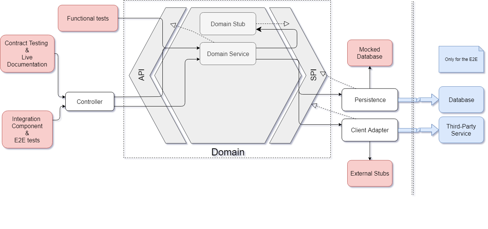

# Testing Strategy
TalkAdvisor is following the [microservice testing philosophy](https://martinfowler.com/articles/microservice-testing/#conclusion-summary).
We will try here to explain how to get a cleaner test strategy in a microservice implemented according to the Hexagonal Architecture.



## Functional Tests

### The anti-pattern

Working with Domain-Driven Design and the Hexagonal Architecture, usually means applying the Behavior-Driven Development methodology.
Many people have understood it and this technique is now widely spread. Unfortunately, we often see that the functional tests used to describe the behavior of modern application, are implemented as a http client hitting the endpoints of the controllers.
The main drawback of this (anti-)pattern is the mix of the testing concerns. With this kind of test, we have something that has the responsibility to verify:
 * the business logic of the application *(functional tests)*
 * the contract of the external API *(contract tests)*
 * the workflow offered to the consumer - or something which looks like to it *(end to end tests)*
 * sometimes the mapping between the domain objects and the adapters *(unit tests / integration tests)*
 * the integration of the different sub-components of the application such as the Controllers, the DomainServices, the Repositories... *(integration tests / component tests)*
 * and most of the time without knowing it: the living documentation *(contract testing)*
 
A simple serialization problem will fail this kind of test, and as a developer we will have to figure out if a regression has been made in the business logic or if something goes wrong with the configuration of a framework.
Which becomes a real hell when upgrading a structural framework like Spring Boot after playing search-and-destroy with the compilation errors...

The sustainability is not the only victim of this technique. Which framework to use when having a test which has that many responsibilities? [Cucumber](https://docs.cucumber.io/) might be one of the best choice to express the rules and the acceptance criteria of the business.
But testing the contract of a web API with it, can be really cu-cumbersome and the developer efficiency might be left behind.

### The Best practices

Back to the basics, since the aim of a functional test is "testing the business logic", putting it inside the domain of our application looks like a good idea. As a result instead of calling the endpoints, those tests are plugged in top of the API of the domain (not the Web API one).


In TalkAdvisor, [Cucumber](https://docs.cucumber.io/) is used to define the features and the scenarios of our business logic. As you can see the feature files are located in [the tests packages of the domain](https://gitlab.com/crafts-records/talkadvisor/talkadvisor-back/tree/master/talkadvisor-domain/src/test/resources/features) beside the [step definitiions](https://gitlab.com/crafts-records/talkadvisor/talkadvisor-back/tree/master/talkadvisor-domain/src/test/kotlin/org/craftsrecords/talkadvisor/recommendation/stepdefs).
Using the [Gherkin language](https://docs.cucumber.io/gherkin/reference/), we express the scenarios of a feature [profiles.feature](https://gitlab.com/crafts-records/talkadvisor/talkadvisor-back/blob/master/talkadvisor-domain/src/test/resources/features/profiles.feature):
```gherkin
Feature: As a frequent user,
  In order not repeat my preferences at each request,
  I want to create my profile with my preferences

  Scenario: The user is creating his profile with his preferences

    Given a user
    And he wants to learn
      | DDD | hexagonal architecture |
    And he only wants to see
      | QUICKIE | CONFERENCE |
    When he creates his profile
    Then his preferences are stored within
```

Let's remind some best practices here:
 * the scenario must be functional and [not technical](https://docs.cucumber.io/bdd/better-gherkin/)
 * the persona must be defined ``As a frequent user`` because a feature performed by different persona is really likely to have distinct acceptance criteria. Think about what differences you can have when an admin or an user are using the same feature
 * Only **ONE** When, you should test one thing at a time, what's about the acceptance criteria with several whens ?
 * Don't use conjunctions in your Givens and Thens, it makes them really hard to reuse, prefer to split your step into several ones  

The step definitions are the fixtures of your test, they implement all the Gherkin's directives of your features [ProfileStepdefs.kt](https://gitlab.com/crafts-records/talkadvisor/talkadvisor-back/blob/master/talkadvisor-domain/src/test/kotlin/org/craftsrecords/talkadvisor/recommendation/stepdefs/ProfileStepdefs.kt):
```kotlin
import org.craftsrecords.talkadvisor.recommendation.api.CreateProfile
import org.craftsrecords.talkadvisor.recommendation.spi.Profiles

class ProfileStepdefs(private val testContext: TestContext,
                      private val createProfile: CreateProfile,
                      private val profiles: Profiles) {

    @Given("^he already has a profile$")
    fun `he already has a profile`() {
        val profile = Profile(testContext.userId, createPreferences())
        profiles.save(profile)
    }

    @When("^he creates his profile$")
    fun `he creates his profile`() {
        val preferences = preferencesFromContext()

        val profile = createProfile.forUserWithPreferences(testContext.userId, preferences)

        testContext.requestedPreferences = preferences
        testContext.createdProfile = profile
    }


    @Then("^his preferences are stored within$")
    fun `his preferences are stored within`() {
        val profile = testContext.createdProfile
        val frequentUser = testContext.userId
        val hisPreferences = testContext.requestedPreferences

        profile.that `corresponds to user` frequentUser
        profile.that `has preferences` hisPreferences
    }
}
```
> You may have noticed some strange assertions here: ```profile.that `corresponds to user` frequentUser```, which framework is that? Let's discover it in that [section](#custom-assertions).

Like said above, instead of hitting the web endpoints of the application, we are using directly here the domain API, through [CreateProfile](https://gitlab.com/crafts-records/talkadvisor/talkadvisor-back/blob/master/talkadvisor-domain/src/main/kotlin/org/craftsrecords/talkadvisor/recommendation/api/CreateProfile.kt) - a domain service.
So basically all the Whens of our step definitions will call the methods of the domain services exposed through the API = **the features**. In the Givens and the Thens, we respectively creates and asserts on the domain objects. And if needed we can bootstrap or assert some data through the SPI. 
You can see this in the example above, in a scenario [not shown here](https://gitlab.com/crafts-records/talkadvisor/talkadvisor-back/blob/d58d0dee5b92eac15765d6f0f1bd467040dae915/talkadvisor-domain/src/test/resources/features/profiles.feature#L17), the fact that the user already has a profile is a prerequisite. 
So a profile is bootstrapped for this user directly stored in the "database" using the [Profile repository](https://gitlab.com/crafts-records/talkadvisor/talkadvisor-back/blob/master/talkadvisor-domain/src/main/kotlin/org/craftsrecords/talkadvisor/recommendation/spi/Profiles.kt) in the SPI.
You can also use the same technique when using a side effect feature to perform some assertions in a Then.

Most of the time people are slicing their step definitions the same way their scenarios are sliced. As you can read it from the [cucumber documentation itself](https://docs.cucumber.io/guides/anti-patterns/), it couples everything together and the steps you have made cannot be reused for another scenario.
The step definitions should be organised the same way than your domain concept and moreover named after it. This way your step definitions code will be factorised, easier to be found and to navigate through, you'll end up with steps which are more maintainable and reusable.
So in other words, **the step definitions should be designed with the same processes we are using to build our business domain!**

You may wondering how we can share data between several step definitions which is mandatory if we need to reuse them. Cucumber is offering [an integration with the Pico container](https://docs.cucumber.io/cucumber/state/#dependency-injection), a lightweight dependency injection framework.
Once the dependency is added to your pom, you simply have to define a Bean Factory where you will register the beans you need [CustomPicoFactory](https://gitlab.com/crafts-records/talkadvisor/talkadvisor-back/blob/master/talkadvisor-domain/src/test/kotlin/org/craftsrecords/talkadvisor/CustomPicoFactory.kt):

```kotlin
class CustomPicoFactory : PicoFactory() {
    init {
        addClass(TestContext::class.java)
        addClass(TalksAdvisor::class.java)
        addClass(HardCodedTalksSearcher::class.java)
        addClass(InMemoryRecommendations::class.java)
        addClass(ProfileCreator::class.java)
        addClass(InMemoryProfiles::class.java)
    }
}
```

Then define a [cucumber.properties](https://gitlab.com/crafts-records/talkadvisor/talkadvisor-back/blob/master/talkadvisor-domain/src/test/resources/cucumber.properties) in your test resources, to register this factory in the Cucumber context.

```properties
cucumber.api.java.ObjectFactory=org.craftsrecords.talkadvisor.CustomPicoFactory
```

With that no need to have a test dependency on the whole Spring Framework! Pico is really easy to set-up as easy to use.
Now you can inject your Domain Services and Stubs inside your step definitions and as well share [a context](https://gitlab.com/crafts-records/talkadvisor/talkadvisor-back/blob/master/talkadvisor-domain/src/test/kotlin/org/craftsrecords/talkadvisor/recommendation/stepdefs/TestContext.kt) between them.

> Last Tip: Instead of having one single launcher for all the function tests, you can have one launcher per scenario. This is pretty convenient when you only want to run the scenarios of a single feature without playing with tags and configuration. Take a look at this [example](https://gitlab.com/crafts-records/talkadvisor/talkadvisor-back/blob/master/talkadvisor-domain/src/test/kotlin/org/craftsrecords/talkadvisor/recommendation/RecommendationFunctionalTests.kt). 

### Domain Stubs

While implementing a feature, we often need to call some external dependencies which offers a service to our domain, such as [YouTubeSearchTalks](https://gitlab.com/crafts-records/talkadvisor/talkadvisor-back/blob/master/talkadvisor-infra/talkadvisor-infra-application/src/main/kotlin/org/craftsrecords/talkadvisor/infra/youtube/YouTubeSearchTalks.kt) our YouTube client.
But since the domain cannot depends on external stuff, how can we test it ? The response is pretty simple, we creates a lightweight component which implements the SPI **inside the domain** [HardCodedTalksSearcher](https://gitlab.com/crafts-records/talkadvisor/talkadvisor-back/blob/master/talkadvisor-domain/src/main/kotlin/org/craftsrecords/talkadvisor/recommendation/spi/stubs/HardCodedTalksSearcher.kt). 
This will ensure the inside of the hexagon - the domain of our application - will be self-tested.
Why not only a Mock inside the tests ? The domain stub is more that just a testing tool, it helps you to focus on the important thing of your development process, more information about that [here](https://beyondxscratch.com/2017/08/19/decoupling-your-technical-code-from-your-business-logic-with-the-hexagonal-architecture-hexarch/).

Actually in TalkAvisor, only the SPI part related to the provisioning of the Talks has been implemented through a YouTube client. The repositories which are used to store our profiles and recommendations are implemented using HashMaps e.g. [InMemoryProfiles](https://gitlab.com/crafts-records/talkadvisor/talkadvisor-back/blob/master/talkadvisor-domain/src/main/kotlin/org/craftsrecords/talkadvisor/recommendation/spi/stubs/InMemoryProfiles.kt).
This way we can focus on the main purpose of the application - recommending talks - and delay some technical concern like "what will be the best database system for my software ?".


## Unit Tests and Test Composition:

TODO SOMETHING ABOUT NOT HAVING MOCKITO IN THE DOMAIN

For example in the resources, when testing the mapping of a Profile Domain to a Profile Resource,
we don't add a unit test inside resources.PreferencesTest to verify the mapping of a Preferences Resource 
since the Profile, which contains it, will test it by composition 
### Custom Assertions
[TALK] talk about custom assert and factories

Custom asserts in the adapters: Mapping a domain object to an adapter one can be done in several places
Storing the mapping validation inside a custom assert will ensure no mapping tests will miss a new acceptance criteria.
Use as well in the domain unit tests, the functional tests, and in the infrastructure.
TODO: GIVE AN EXAMPLE IN THE CODE

TODO: WORD ON Test Composition ? here somewhere else ? 

## Documentation

More than a specification, the feature tests written in Gherkin is a real living documentation of your application. It should reflects what is the behavior of a feature in a given scenario, pretty helpful when you need to improve or maintain the domain.
That's why we strongly recommend to make sure the Cucumber tests will fails if your step definitions are not implemented. **Having a confusing (lying) documentation is worse than not having documentation at all!**
By default cucumber will just log some warns, to prevent the test from being successful just add the ``strict`` option in the configuration of your [runners](https://gitlab.com/crafts-records/talkadvisor/talkadvisor-back/blob/master/talkadvisor-domain/src/test/kotlin/org/craftsrecords/talkadvisor/recommendation/RecommendationFunctionalTests.kt).

```kotlin
@CucumberOptions(strict = true, plugin = ["pretty", "json:target/cucumber/recommendation.json"], features = ["classpath:features/recommendations.feature"])
``` 
 

